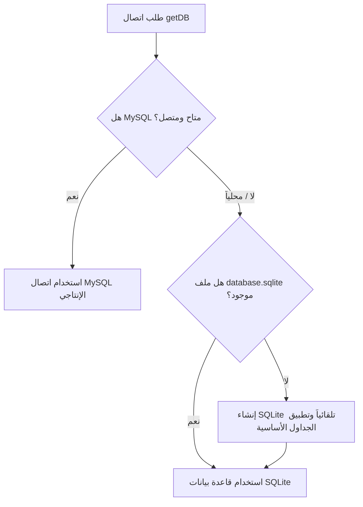

# كود التطور — منصة الأدوات الشاملة (Code Elta6ur Tools Platform)

[](https://www.php.net/)
[](https://developer.mozilla.org/)
[](https://sqlite.org/)
[](https://code-elta6ur.sy/)
[](#)

منصة ويب عربية شاملة ومتطورة، تضم أكثر من **218 أداة وحاسبة عملية تفاعلية** تغطي مجالات المال والأعمال، البناء والتشطيب، الطاقة والكهرباء، السيارات والسفر، التعليم، معالجة النصوص، وأدوات المطورين.

صُممت المنصة وفق معمارية برمجية خفيفة وسريعة تعتمد على **Native PHP** و **Vanilla JS** بدون أي أطر عمل ثقيلة، مع دعم التبديل التلقائي الذكي بين **MySQL** و **SQLite**، ونظام تصميم عصري يدعم اتجاه القراءة من اليمين إلى اليسار (RTL) مع أسلوب الـ Dark Mode، لتعمل كمركز خدمي رئيسي ضمن **منظومة كود التطور (Code Elta6ur Ecosystem)**.

---

## 📑 فهرس المحتويات

- [نظرة عامة](#-نظرة-عامة)
- [المميزات الرئيسية](#-المميزات-الرئيسية)
- [تصنيفات الأدوات (218 أداة)](#-تصنيفات-الأدوات-218-أداة)
- [التقنيات المستخدمة](#-التقنيات-المستخدمة)
- [بنية المشروع](#-بنية-المشروع)
- [التشغيل المحلي خطوة بخطوة](#-التشغيل-المحلي-خطوة-بخطوة)
- [إعداد قواعد البيانات والتبديل التلقائي](#-إعداد-قواعد-البيانات-والتبديل-التلقائي)
- [إعدادات البيئة والأمان](#-إعدادات-البيئة-والأمان)
- [معمارية الأدوات وكيفية إضافة أداة جديدة](#-معمارية-الأدوات-وكيفية-إضافة-أداة-جديدة)
- [واجهة البحث البرمجية (API)](#-واجهة-البحث-البرمجية-api)
- [منظومة كود التطور](#-منظومة-كود-التطور)
- [فحص الجودة والاختبارات](#-فحص-الجودة-والاختبارات)
- [النشر على خادم الإنتاج (Deployment)](#-النشر-على-خادم-الإنتاج-deployment)
- [المساهمة في المشروع](#-المساهمة-في-المشروع)
- [المطور الرئيسي وحقوق الملكية](#-المطور-الرئيسي-وحقوق-الملكية)

---

## 📌 نظرة عامة

### المشكلة التي تحلها المنصة
يعاني المستخدم العربي غالبًا من تشتت الأدوات والحاسبات عبر مواقع متعددة مليئة بالإعلانات المزعجة، أو من أدوات غربية لا تدعم العملات العربية، أو تعتمد على حسابات تقديرية غير موثقة.

### الحل
توفر **منصة كود التطور للأدوات** مرجعاً موحداً يجمع كل ما يحتاجه:
- **الموظف والباحث عن عمل:** حاسبات الرواتب، الضرائب، الأوفر تايم، وبناء السيرة الذاتية.
- **أصحاب المشاريع والمستقلون:** تسعير المشاريع والخدمات، حاسبات نقطة التعادل، وهامش الربح و ROI و ROAS.
- **أصحاب المنازل والحرفيون:** حاسبات تشطيب المنازل، الدهان، البلاط، الإسمنت، والجبس بورد.
- **المهتمون بالطاقة:** حساب منظومات الطاقة الشمسية، البطاريات، المولدات، واستهلاك الأجهزة الكهربائية.
- **الطلاب والمعلمون:** حساب المعدلات التراكمية، خطط المذاكرة والمراجعة، ونسب العلامات.
- **صناع المحتوى والمطورون:** محررات الماركداون العربية، معالجة النصوص، وتنسيق وضغط وفحص الأكواد والبيانات.

---

## ✨ المميزات الرئيسية

- **218 أداة تفاعلية حقيقية 100%:** لا توجد صفحات شكلية أو أدوات قيد التطوير (Zero Placeholders / No Fake Data).
- **دعم 21 عملة عربية ودولية:** تحويل فوري وديناميكي مع تنسيق الأرقام والرموز المحلية (`SAR`, `AED`, `EGP`, `SYP`, `JOD`, `KWD`, `USD`, `EUR`, إلخ).
- **تصميم Mobile-First بالكامل:** تجربة لمسية مرنة ومختبرة على كافة الشاشات من 320px حتى شاشات الحواسيب الكبيرة دون أي تجاوز أفقي (No Overflow).
- **محرك بحث فوري مع مرادفات اللغة العربية:** خوارزمية بحث ذكية تفهم المترادفات الشائعة (مثال: راتب = مرتب = معاش = أجر = دخل).
- **معمارية موحدة وقابلة للتوسع (Unified Tool Layout):** بنية مشتركة لكل أداة تتضمن المدخلات، النتائج البارزة، البطاقات الإحصائية، توثيق المعادلات، والأسئلة الشائعة مع Structured Data.
- **حفظ المدخلات محلياً (LocalStorage Persistence):** استعادة آخر مدخلات المستخدم تلقائياً عند إعادة زيارة الأداة دون الحاجة لكتابتها مجدداً.
- **أدوات مشاركة وتصدير احترافية:** أزرار مدمجة لنسخ النتائج، مشاركتها عبر متصفح الهاتف، تحميلها كملف نصي منسق، أو طباعتها.
- **نظام حسابات وصلاحيات متكامل:** تسجيل الدخول، إنشاء الحسابات، لوحة تحكم المستخدم، إدارة المفضلات، وحفظ المخرجات.
- **أرشفة قوية (SEO & Schema.org):** كل أداة تمتلك صفحة مستقلة وروابط Canonical ووسوم Open Graph وبيانات `FAQPage` منظمة لمحركات البحث.

---

## 🗂️ تصنيفات الأدوات (218 أداة)

تنقسم الأدوات داخل المنصة إلى 8 مجموعات رئيسية من خلال سجل الأدوات المركزي:

| التصنيف | الأيقونة | عدد الأدوات | أبرز الأمثلة |
| :--- | :---: | :---: | :--- |
| **المال والعمل والتجارة** | `fa-coins` | 30 | صافي الراتب، تكلفة الموظف، الأوفر تايم، العمولات، نقطة التعادل، ROAS ،CAC ،LTV ،ROI، تسعير الفريلانسرز. |
| **المنزل والبناء والتشطيب** | `fa-home` | 30 | تكلفة بناء وتشطيب منزل، حساب كميات الدهان، السيراميك، البلوك، الإسمنت، الرمل، درجات السلم، والعزل المائي. |
| **الكهرباء والطاقة الشمسية** | `fa-bolt` | 25 | استهلاك الأجهزة (المكيف، الثلاجة، السخان)، حساب بطاريات وإنفرتر و UPS، ألواح الطاقة الشمسية وفترة استرداد التكلفة. |
| **السيارات والسفر** | `fa-car` | 11 | تكلفة البنزين الشهرية، تكلفة الرحلات وتقسيم النفقات، مقارنة سيارات البنزين مقابل الكهربائية، شراء سيارة مقابل المواصلات. |
| **الدراسة والتعليم** | `fa-graduation-cap` | 19 | المعدل التراكمي، العلامة المطلوبة للنجاح، خطة المراجعة، وقت إنهاء المنهج، وتوزيع الدرجات. |
| **الحياة اليومية والمال الشخصي** | `fa-wallet` | 17 | هل راتبي يكفيني؟، ميزانية الأسرة، تقسيم الراتب 50/30/20، متى أستطيع شراء منزل أو سيارة، وتكاليف الانتقال والهجرة. |
| **النصوص والمحتوى العربي** | `fa-font` | 31 | محرر Markdown عربي بمعاينة فورية، عداد الكلمات والأحرف، تنظيف النصوص، تحويل السلاج العربي، واستخراج الروابط والإيميلات. |
| **المطورين والتقنية** | `fa-code` | 30 | منسقات ومحققات JSON, XML, HTML, CSS, JS, SQL، تشفير Base64, URL, JWT, UUID, فاحص Regex، ومولدات التدرجات والظلال. |
| **الإنتاجية وإدارة الأعمال** | `fa-rocket` | 25 | مولد السيرة الذاتية (CV)، عروض المشاريع، مولدات خطابات التغطية، ساعة تتبع الوقت، وقوائم المهام (To-Do). |

---

## 🛠️ التقنيات المستخدمة

- **الواجهة الأمامية (Frontend):**
  - **HTML5:** بناء دلالي متوافق مع معايير الـ SEO وقابلية الوصول (Accessibility).
  - **CSS3:** نظام تصميم أصلي خالص يعتمد على CSS Custom Properties، وتدرجات لونية، ومؤثرات Glassmorphism، دون Tailwind أو Bootstrap لضمان أعلى أداء وأخف وزن.
  - **JavaScript (Vanilla ES6+):** معالجة فورية لكافة الحسابات والتحويلات بدون أطر عمل ضخمة.
  - **الخطوط والأيقونات:** خط `Cairo` العربي من Google Fonts، ومكتبة `Font Awesome 6.5`.

- **الواجهة الخلفية (Backend):**
  - **PHP 8.0+:** كود معياري نظيف ومنظم يعتمد على الدوال الموديلية، وإدارة الجلسات الآمنة، واستدعاء القوالب الديناميكية.
  - **PDO (PHP Data Objects):** طبقة وسيطة للتواصل مع قواعد البيانات بشكل آمن ضد هجمات الـ SQL Injection.

- **قواعد البيانات (Database):**
  - **MySQL / MariaDB:** قاعدة البيانات الأساسية لبيئة الإنتاج والاستضافة المباشرة.
  - **SQLite 3:** محرك مدمج خفيف يعمل كبديل تلقائي (Fallback) للتشغيل المحلي والتطوير السريع دون الحاجة لتنصيب MySQL.

- **الأمان والحماية:**
  - حماية كاملة من هجمات CSRF عبر توكنات مشفرة `_csrf_token`.
  - تخزين كلمات المرور بتشفير `PASSWORD_BCRYPT`.
  - إعدادات أمان الكوكيز: `HttpOnly`, `SameSite=Lax`, `use_strict_mode`.
  - ملف `.htaccess` لحماية المجلدات الحساسة (`config/`, `database/`, `includes/`) وتفعيل ضغط Gzip وترميز UTF-8.

---

## 📂 بنية المشروع

```text
code-elta6ur-tools/
│
├── admin/                  # لوحة التحكم وإدارة الأدوات والمستخدمين والإحصائيات
│   ├── index.php           # نظرة عامة وإحصائيات لوحة الإدارة
│   ├── tools-manage.php    # تفعيل وتعطيل وإدارة الأدوات
│   └── users.php           # إدارة حسابات المستخدمين وصلاحياتهم
│
├── api/                    # واجهات برمجة التطبيقات (REST Endpoints)
│   ├── save-output.php     # حفظ نتائج الأدوات في حساب المستخدم
│   ├── search-tools.php    # محرك البحث الفوري بالمرادفات العربية
│   └── toggle-favorite.php # إضافة/إزالة الأدوات من المفضلة
│
├── assets/                 # الأصول الثابتة
│   ├── css/
│   │   └── style.css       # نظام التصميم الموحد، الألوان، وأنماط الشاشات
│   └── js/
│       ├── app.js          # الجافاسكريبت الرئيسي (البحث، القوائم، التنبيهات)
│       └── tools.js        # وظائف تفاعلية إضافية للأدوات
│
├── auth/                   # نظام المصادقة
│   ├── login.php           # صفحة تسجيل الدخول
│   ├── register.php        # صفحة إنشاء حساب جديد
│   └── logout.php          # إنهاء الجلسة الآمن
│
├── config/                 # ملفات الإعدادات والاتصال
│   ├── app.php             # إعدادات التطبيق العامة ومسارات الـ BASE_URL
│   └── database.php        # إعدادات PDO والتبديل التلقائي الذكي لـ SQLite
│
├── database/               # ملفات ومخططات قواعد البيانات
│   ├── schema.sql          # بنية الجداول لـ MySQL
│   ├── seed.sql            # البيانات الافتراضية
│   ├── database.sqlite     # قاعدة بيانات SQLite المحلية الاحتياطية
│   └── .htaccess           # منع الوصول المباشر لملفات قواعد البيانات
│
├── includes/               # المكونات البرمجية والقوالب المشتركة
│   ├── auth.php            # دوال التحقق من الجلسات والصلاحيات
│   ├── ecosystem_data.php  # سجل وبيانات منصات منظومة كود التطور والمطور
│   ├── footer.php          # تذييل الموقع الموحد وفوتر المنظومة
│   ├── functions.php       # الدوال المساعدة العامة والتعقيم والأمان
│   ├── header.php          # رأس الصفحة، وسم الميتا، وشريط التنقل
│   ├── sidebar.php         # القائمة الجانبية وتصنيفات الأدوات
│   ├── tool_layout.php     # مكونات عرض الأدوات الموحدة وحساب العملات
│   └── tools_registry.php  # سجل الـ 218 أداة المركزي مع التصنيفات والـ SEO
│
├── scripts/                # سكربتات التطوير وفحص الجودة والنشر
│   ├── deploy_to_server.py # سكربت النشر الآلي عبر SSH/SFTP
│   ├── fast_syntax_check.php # فاحص بناء الجمل البرمجية الفوري للأدوات
│   ├── test_http_endpoints.php # فاحص استجابة الروابط والـ API
│   └── verify_status.php   # فاحص تطابق الأدوات مع السجل المركزي
│
├── tools/                  # صفحات الأدوات الـ 218 (ملفات تنفيذية مستقلة)
│   ├── net-salary-calculator.php
│   ├── electricity-consumption-calculator.php
│   ├── paint-calculator.php
│   ├── markdown-arabic-editor.php
│   └── ... (218 أداة كاملة)
│
├── user/                   # صفحات لوحة تحكم المستخدم
│   ├── dashboard.php       # لوحة معلومات المستخدم والمخرجات الأخيرة
│   ├── favorites.php       # قائمة الأدوات المفضلة
│   └── profile.php         # تعديل بيانات الحساب وكلمة المرور
│
├── .htaccess               # إعدادات خادم Apache والحماية وضغط الملفات
├── ecosystem.php           # صفحة دليل منظومة كود التطور المستقلة
├── index.php               # الصفحة الرئيسية للمنصة ودليل الأدوات الشامل
├── README.md               # التوثيق الشامل للمستودع
└── tool.php                # الموجه الديناميكي للأدوات بالـ Slug
```

---

## 🚀 التشغيل المحلي خطوة بخطوة

لا يتطلب المشروع أي أدوات تجميع أو حزم Node أو Composer؛ يمكنك تشغيله مباشرة في ثوانٍ:

### 1. المتطلبات الأساسية
- تثبيت **PHP 8.0** أو أحدث.
- دعم إضافات PHP التالية (مفعلة افتراضياً في معظم بيئات PHP):
  - `pdo`
  - `pdo_sqlite` (للتشغيل الفوري بدون سيرفر قاعدة بيانات)
  - `pdo_mysql` (اختياري، في حال الرغبة باستخدام MySQL محلياً)
  - `curl`

### 2. استنساخ المستودع
```bash
git clone https://github.com/mokashreef/code-elta6ur-tools.git
cd code-elta6ur-tools
```

### 3. تشغيل خادم التطوير المدمج (PHP Built-in Server)
من داخل مجلد المشروع الرئيسي، نفّذ الأمر التالي:
```bash
php -S 127.0.0.1:8080
```

### 4. تصفح الموقع
افتح متصفح الويب وتوجه إلى:
```text
http://127.0.0.1:8080/
```
> **ملاحظة:** سيعمل الموقع مباشرة وبكامل وظائفه؛ حيث ستقوم المنصة تلقائياً بتهيئة ملف SQLite الاحتياطي `database/database.sqlite` عند أول تشغيل بدون أي تدخل يدوي!

---

## 🗄️ إعداد قواعد البيانات والتبديل التلقائي

تم تصميم ملف الاتصال [`config/database.php`](file:///d:/my%20projects/كود%20التطور%20للسورين/config/database.php) بنظام **Zero-Config Smart Fallback**:



### في حال أردت استخدام MySQL محلياً:
1. أنشئ قاعدة بيانات باسم `elta6ur_tools`.
2. استورد ملف الهيكل [`database/schema.sql`](file:///d:/my%20projects/كود%20التطور%20للسورين/database/schema.sql).
3. استورد ملف البيانات [`database/seed.sql`](file:///d:/my%20projects/كود%20التطور%20للسورين/database/seed.sql).
4. عدل بيانات الاتصال داخل [`config/database.php`](file:///d:/my%20projects/كود%20التطور%20للسورين/config/database.php):
```php
define('DB_HOST', 'localhost');
define('DB_NAME', 'elta6ur_tools');
define('DB_USER', 'root');
define('DB_PASS', 'your_password');
define('DB_CHARSET', 'utf8mb4');
```

---

## 🧩 معمارية الأدوات وكيفية إضافة أداة جديدة

تعتمد المنصة على معمارية الأدوات الموحدة لتسهيل الصيانة وإضافة مئات الأدوات دون أي تكرار كودي.

### خطوات إضافة أداة جديدة (مثال: `bmi-calculator`):

#### 1. تسجيل الأداة في [`includes/tools_registry.php`](file:///d:/my%20projects/كود%20التطور%20للسورين/includes/tools_registry.php):
أضف تعريف الأداة في مصفوفة السجل المركزي:
```php
'bmi-calculator' => [
    'name' => 'حاسبة مؤشر كتلة الجسم (BMI)',
    'description' => 'احسب مؤشر كتلة جسمك بدقة وتعرف على الوزن المثالي والفئة الصحية',
    'category' => 'life',
    'icon' => 'fa-weight',
    'keywords' => ['bmi', 'وزن', 'طول', 'مؤشر كتلة الجسم', 'سمنة', 'رشاقة'],
    'related' => ['water-intake-calculator', 'calories-calculator']
],
```

#### 2. إنشاء ملف الأداة في [`tools/bmi-calculator.php`](file:///d:/my%20projects/كود%20التطور%20للسورين/tools/):
استخدم المكونات الجاهزة من `includes/tool_layout.php`:
```php
<?php
require_once __DIR__ . '/../config/app.php';
require_once __DIR__ . '/../includes/tools_registry.php';
require_once __DIR__ . '/../includes/tool_layout.php';

$slug = 'bmi-calculator';
$tool = getToolBySlug($slug);
if (!$tool) { redirect('index.php'); }

include __DIR__ . '/../includes/header.php';
?>

<div class="container tool-container">
    <?php renderToolHeader($tool); ?>

    <div class="tool-content-grid">
        <div class="tool-card card">
            <div class="card-header">
                <h3 class="card-title"><i class="fas fa-sliders-h text-accent"></i> أدخل بيانات القياس</h3>
            </div>
            <div class="card-body">
                <div class="form-group">
                    <label class="form-label" for="weight">الوزن (كجم)</label>
                    <input type="number" id="weight" class="form-control" value="75" min="20" max="300" oninput="calculateTool()">
                </div>
                <div class="form-group">
                    <label class="form-label" for="height">الطول (سم)</label>
                    <input type="number" id="height" class="form-control" value="175" min="50" max="250" oninput="calculateTool()">
                </div>
                <div class="tool-actions-bar" style="display:flex;gap:0.75rem;margin-top:1.5rem">
                    <button type="button" class="btn btn-primary" onclick="calculateTool()"><i class="fas fa-calculator"></i> احسب الآن</button>
                    <button type="button" class="btn btn-ghost" onclick="resetToolInputs()"><i class="fas fa-undo"></i> إعادة تعيين</button>
                </div>
            </div>
        </div>

        <div class="tool-result-wrapper">
            <?php renderResultArea('نتيجة مؤشر كتلة الجسم'); ?>
        </div>
    </div>

    <?php 
    renderToolExplanation('معادلة الحساب', ['BMI = الوزن (كجم) ÷ (الطول بالمتر)²']);
    renderToolFAQ([
        ['q' => 'ما هو المعدل الطبيعي؟', 'a' => 'المعدل الطبيعي لمؤشر كتلة الجسم يتراوح بين 18.5 و 24.9.']
    ]);
    renderRelatedTools($tool['related'] ?? []);
    ?>
</div>

<?php renderToolScriptHelpers(); ?>

<script>
function calculateTool() {
    const w = parseFloat(document.getElementById('weight').value) || 0;
    const h = (parseFloat(document.getElementById('height').value) || 0) / 100;
    if (w <= 0 || h <= 0) return;

    const bmi = (w / (h * h)).toFixed(1);
    setPrimaryResult(bmi, 'مؤشر كتلة الجسم (BMI)');
    showResultArea();

    setDetailStats([
        { label: 'الوزن المعتمد', value: w + ' كجم', color: '#3b82f6' },
        { label: 'الطول المعتمد', value: (h * 100) + ' سم', color: '#10b981' }
    ]);
    saveLastInputs('bmi-calculator');
}
document.addEventListener('DOMContentLoaded', () => {
    restoreLastInputs('bmi-calculator');
    calculateTool();
});
</script>

<?php include __DIR__ . '/../includes/footer.php'; ?>
```

ستكون الأداة متاحة فوراً على الرابط: `tool.php?slug=bmi-calculator` وقابلة للبحث والفهرسة فوراً!

---

## 🔌 واجهة البحث البرمجية (API)

توفر المنصة نقطة نهاية RESTful خفيفة تدعم البحث الفوري في جميع الأدوات:

### Endpoint: البحث في الأدوات
- **الرابط:** `/api/search-tools.php?q={query}`
- **طريقة الطلب:** `GET`
- **نوع المحتوى:** `application/json; charset=utf-8`

#### نموذج الرد (Response Example):
```json
[
  {
    "id": 1,
    "slug": "net-salary-calculator",
    "name": "حاسبة صافي الراتب بعد الخصومات",
    "description": "احسب صافي راتبك الشهري بدقة بعد خصم التأمينات الاجتماعية والضرائب والخصومات الإضافية",
    "category": "finance",
    "icon": "fa-money-bill-wave",
    "keywords": ["راتب", "مرتب", "صافي", "خصومات"],
    "search_score": 75
  }
]
```

---

## 🌐 منظومة كود التطور (Code Elta6ur Ecosystem)

تعتبر هذه المنصة جزءاً لا يتجزأ من منظومة كود التطور التقنية، التي توفر حلولاً متعددة التخصصات:

| المنصة / المشروع | الرابط | التخصص |
| :--- | :--- | :--- |
| **كود التطور (الرئيسي)** | [code-elta6ur.com](https://code-elta6ur.com/) | المنصة التعليمية لتعليم البرمجة ومواكبة الذكاء الاصطناعي. |
| **AI Portfolio Builder** | [portfolio.code-elta6ur.net](https://portfolio.code-elta6ur.net/) | منشئ معارض الأعمال والمواقع الشخصية الذكي بدون كود. |
| **Code Ora (كود اورا)** | [code-ora.com](https://code-ora.com/) | منصة الدورات التخصصية والمسارات والاختبارات البرمجية. |
| **منصة البكالوريا** | [baccalaureate.code-elta6ur.sy](https://baccalaureate.code-elta6ur.sy/) | المنصة التعليمية الذكية لطلاب الشهادة الثانوية السورية. |
| **كود التطور للبرمجيات** | [code-elta6ur.net](https://code-elta6ur.net/) | وكالة برمجية متخصصة في تطوير أنظمة الشركات و SaaS والمتاجر. |
| **هاردوير بيس (HardwareBase)** | [hardwarebase.code-elta6ur.com](https://hardwarebase.code-elta6ur.com/) | قاعدة المعرفة الشاملة لصيانة الهواتف والعتاد الصلب والدوائر المتكاملة. |

---

## 🧪 فحص الجودة والاختبارات

يحتوي مجلد `scripts/` على سكربتات فحص مؤتمتة وموثوقة:

1. **فحص بناء الجمل البرمجية الفوري (Syntax Linting):**
   ```bash
   php scripts/fast_syntax_check.php
   ```
   *يفحص كامل ملفات الـ 218 أداة في أقل من ثانية واحدة للتأكد من خلوها من أي أخطاء `ParseError`.*

2. **فحص اكتمال الأدوات وتطابقها مع السجل المركزي:**
   ```bash
   php scripts/verify_status.php
   ```
   *يتحقق من وجود ملف تنفيذي مطابق لكل أداة مسجلة في السجل المركزي بنسبة 100%.*

3. **فحص نقاط الـ HTTP والـ API:**
   ```bash
   php scripts/test_http_endpoints.php
   ```

---

## 🏗️ النشر على خادم الإنتاج (Deployment)

يحتوي المستودع على سكربت نشر سحابي ذكي ومؤتمت [`scripts/deploy_to_server.py`](file:///d:/my%20projects/كود%20التطور%20للسورين/scripts/deploy_to_server.py) يعتمد على مكتبة `paramiko`:

### خطوات النشر المؤتمت:
1. تجهيز حزمة إنتاجية خفيفة تستثني الملفات المحلية (`.git`, `scripts/`, إلخ).
2. أخذ نسخة احتياطية سحابية تلقائية من الملفات السابقة على الخادم قبل الاستبدال.
3. رفع الحزمة عبر SFTP وفك ضغطها في مسار `public_html`.
4. ضبط صلاحيات المجلدات (`755`) والملفات (`644`) تلقائياً.
5. التحقق من سلامة تشغيل السيرفر واستجابة الروابط برمز `200 OK`.

---

## 🤝 المساهمة في المشروع (Contributing)

نرحب بمساهمات المطورين لتوسيع وإثراء المنصة بأدوات وحاسبات جديدة:

1. قم بعمل **Fork** للمستودع.
2. أنشئ فرعاً جديداً لميزتك:
   ```bash
   git checkout -b feature/new-calculator
   ```
3. أضف الأداة باتباع [معمارية الأدوات الموحدة](#-معمارية-الأدوات-وكيفية-إضافة-أداة-جديدة).
4. تأكد من اجتياز فحص القواعد:
   ```bash
   php scripts/fast_syntax_check.php
   ```
5. قم بعمل **Commit** للتغييرات برسالة واضحة:
   ```bash
   git commit -m "feat: add water intake calculator"
   ```
6. ارفع الفرع وافتح **Pull Request**.

---

## 👤 المطور الرئيسي وحقوق الملكية

تم تطوير وتأسيس المنظومة والإشراف الهندسي عليها بواسطة:

**م. محمد أبو خشريف (Mohammad Abu Khashrif)**  
*Software Engineer & Full-Stack Developer*  
- **معرض الأعمال (Portfolio):** [mohammad.code-elta6ur.com](https://mohammad.code-elta6ur.com/)
- **حساب GitHub:** [@mokashreef](https://github.com/mokashreef)

---

## 📄 الترخيص (License)

هذا المشروع مطور ومحمي تحت حقوق ملكية **منظومة كود التطور © 2026**.  
جميع الحقوق محفوظة. يُسمح باستخدام المنصة والأدوات بشكل مجاني لجميع المستخدمين والطلاب ورواد الأعمال.
